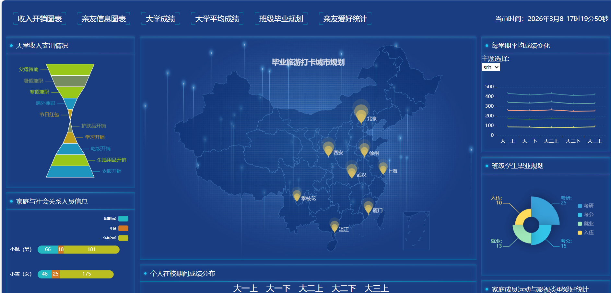
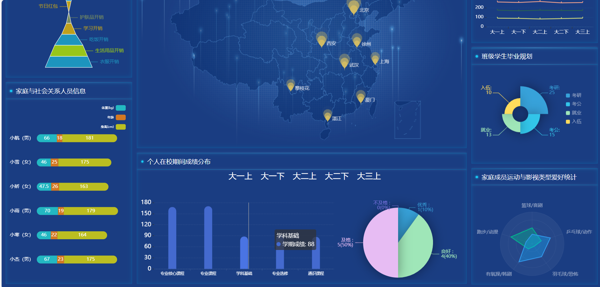
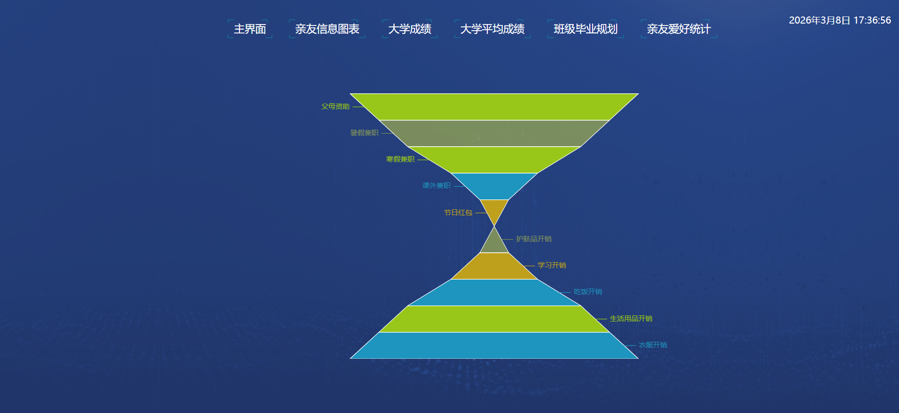
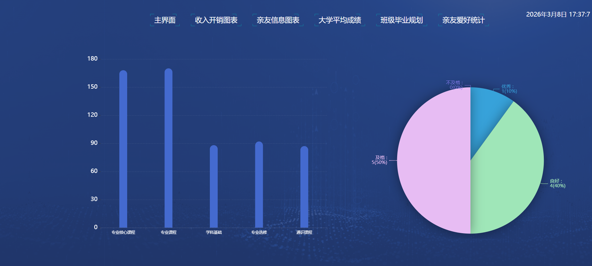

# ECharts 多模块交互式数据可视化大屏

基于 ECharts 开发的前端可视化练手项目，实现了标签页切换与多图表联动展示。

## 项目介绍
本项目是个人学习数据可视化与前端交互的综合实践作品，模拟了个人与班级的多维度数据管理场景。
核心亮点在于实现了**顶部导航标签页的切换功能**，点击不同标签可加载对应的可视化图表模块，提升了数据展示的层次感和交互体验。

## 核心功能
1. **多模块切换**：支持“收入开销”“大学成绩”“毕业规划”等多个维度的标签页切换。
2. **图标联动交互**：在班级毕业规划模块实现了多图标联动。
3. **实时时间显示**：在大屏的右上角集成了实时时间显示，增强了系统的实时感和专业感。
4. **主题配色切换**：在大学成绩模块通过下拉列表可以切换不同主题。
2. **丰富图表类型**：使用 ECharts 实现了漏斗图、地图、折线图、饼图、柱状图等多种可视化效果。
3. **自适应布局**：采用大屏设计风格，适配主流浏览器的展示比例。

## 技术栈
- 核心技术：HTML / CSS / JavaScript
- 可视化库：ECharts

## 数据说明
项目内所有数据均为**模拟测试数据**，仅用于演示前端可视化效果与交互逻辑，不代表真实业务数据。

## 运行方式
将项目文件下载到本地，直接用浏览器打开 `index.html` 文件即可运行。

## 项目截图
### 1. 主界面（多图表综合展示）

### 2. 标签页切换功能（单模块详情展示）

